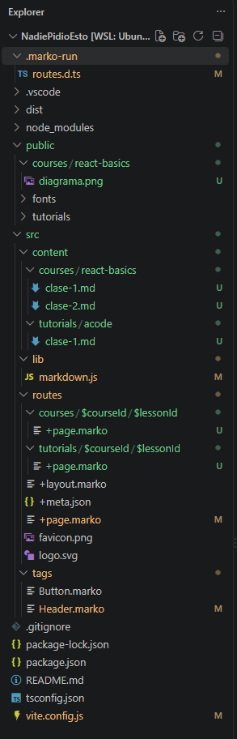

---
# Bienvenidos a la clase

En esta lección aprenderemos los conceptos básicos. Puedes incluir imágenes locales o remotas:

# $$\int \frac{x}{2x}dx $$

También puedes pegar URLs directas de vídeos o recursos:
[Youtube](https://www.youtube.com/watch?v=wJlkQ8qemnU)

